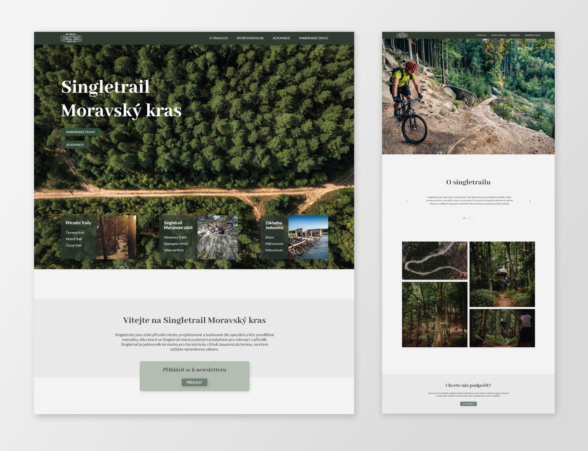
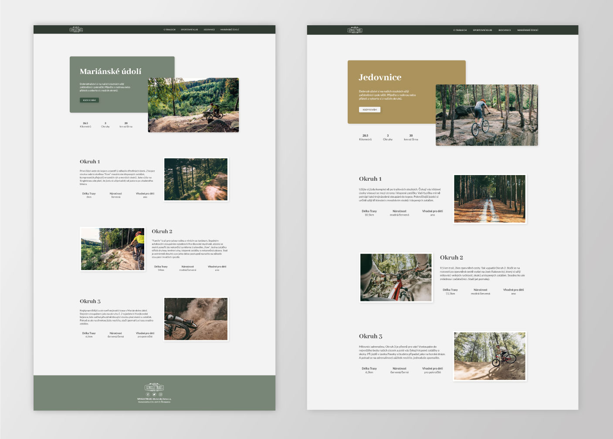

# :biking_man: Single Trail :biking_man:
This project was created for learning purposes. 

## About the project
### 🛠️ The website is still in the process. 🛠️

I have created redesign of multiple page website (singlekras.cz) in Figma, I have used my own design for the project.

Motivation
* Create multiple pages website to improve my skills in frontend field.
* Make the project efficient with using preprocessor SASS, PostHTML
* Try new plugins and libraries 

### Built With

* [SASS](https://sass-lang.com/)
* [Parcel](https://parceljs.org/)
* [PostHTML-include](https://www.npmjs.com/package/posthtml-include)
* [Locomotive-scroll](https://github.com/locomotivemtl/locomotive-scroll)
* [Gsap - GreenSock](https://greensock.com/gsap/)




## Getting Started

Instructions how to setting up project locally.
To get a local copy up and running follow these simple example steps.

### Installation

1. Clone the repo
   ```sh
   git clone https://github.com/dewish/SingleTrail.git
   ```
2. Install NPM packages
   ```sh
   npm install
   ```

### Usage
* Run the project locally
   ```sh
   npm run dev
   ```





## Contact

Lenka Harastova :email: lenca.harastova@gmail.com

Project Link :open_file_folder: https://github.com/dewish/SingleTrail

